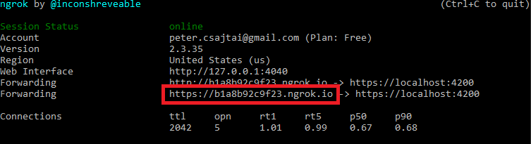

# ConfigCat Feature Flags Trello Power-Up

The [ConfigCat's Trello Power-Up](https://trello.com/power-ups/5e694b66d2511a3601ebd0fb) allows you to connect your Trello Cards and feature flags. Create or link existing flags to your Trello cards without leaving your Trello board.

Turn features On/Off right from a linked card on your Trello board. You can also easily modify the linked flags to edit or add new Targeting or Percentage Rules.

## About ConfigCat

Manage features and change your software configuration using [ConfigCat feature flags](https://configcat.com), without the need to re-deploy code. A [10 minute trainable Dashboard](https://app.configcat.com) allows even non-technical team members to manage features directly. Deploy anytime, release when confident. Target a specific group of users first with new ideas. Supports A/B/n testing and soft launching. Provides [open-source SDKs](https://github.com/configcat) for easy integration with any web, mobile or backend application.

## Installation

1. Add [ConfigCat Power-Up](https://trello.com/power-ups/5e694b66d2511a3601ebd0fb) to your board.
2. Select `Settings -> Authorize Account`.
3. Get your ConfigCat Public API credentials: https://app.configcat.com/my-account/public-api-credentials
4. Click authorize.


## Usage

### Linking existing feature flags

1. Open any Card on your Trello board.
2. Push `Link Feature Flag`
3. Select a ConfigCat Product, Config, Environment and a Feature Flag to be linked to your card.
4. When linked, you can turn your features On / Off right from this Card.


### Creating new feature flags

1. Open any Card on your Trello board.
2. Push the `Create and Link Feature Flag` button.
3. Select a ConfigCat Product and Config where you want to create the feature flag.
4. Set up your feature flag.
5. Select which environment you would like to link to this item.
6. When linked, you can manage the selected feature flag from this Card.


## Run project locally
1. Install npm dependencies  
   ```
   npm install
   ```
2. Start the angular project
   ```
   npm start
   ```
3. Expose your project to the internet with **ngrok**
   ```
   ngrok http --host-header=rewrite https://localhost:4200
   ```
   You should see something like this:
   
4. Go to the [power-ups admin page](https://trello.com/power-ups/admin) of Trello
5. Hit the `Create New Power-Up` button
6. Get your *https ngrok url* (highlighted in the 3rd step) and use it as your `Iframe Connector URL`.
7. Enable these capabilities:
   - [x] Card Back Section
   - [x] Card Badges
   - [x] Card Buttons
   - [x] On Disable
   - [x] Authorization Status
   - [x] Show Authorization
8. If you encounter CORS errors during the ConfigCat public api authorization flow, use [this](https://chrome.google.com/webstore/detail/moesif-origin-cors-change/digfbfaphojjndkpccljibejjbppifbc?hl=en-US) magic stick.

## Contributions are welcome

## Need help?

https://configcat.com/support
